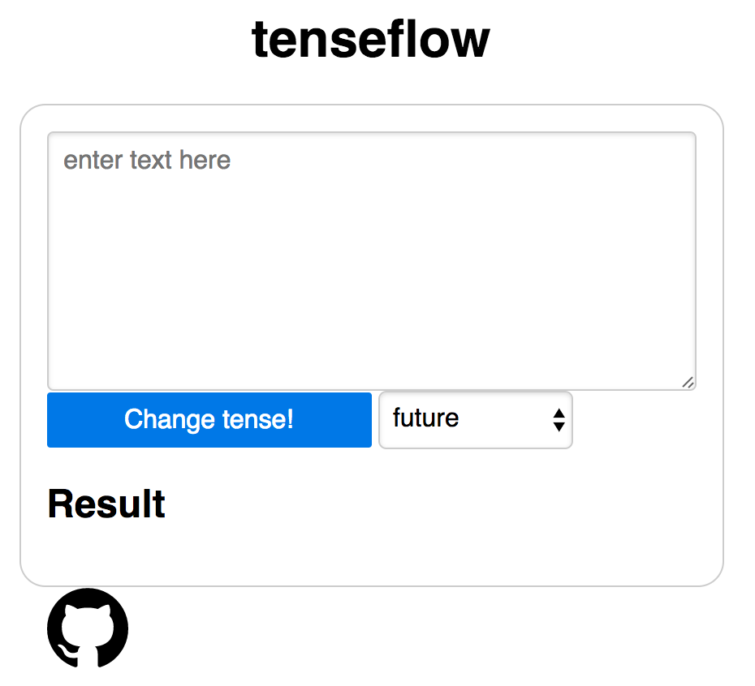

# tenseflow
tenseflow automatically changes the tense of any English text.


## Features
- change to `'past'`, `'present'`, or `'future'` tense
- includes web app


## Installation
install this package
```
git clone 
pip install tenseflow
```
download default English SpaCy model
```
sudo python -m spacy download en
```


## Usage
Basic usage
```python
from tenseflow import change_tense

change_tense('I will go to the store.', 'past')
u'I went to the store.'
```

Run web app
```
export FLASK_APP=app.py
flask run
```